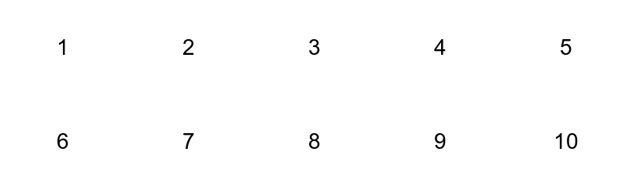
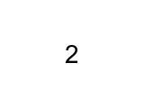
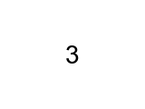

# Quilt tile mosaic script

Simple Bash based tool to combine images from a folder into a single tile mosaic image.

## What this does
Given a folder of image files this script arranges them into a grid with specified number of rows and columns and writes a single image file as output. The script checks that the folder image count exactly matches rows times columns and stops with an error if not.

## Requirements
* ImageMagick version 7 recommended
  Use `magick` command when available
* Python 3 for natural name sorting
* Bash 4 or older is supported; script includes compatibility for macOS default Bash

## Quick install
On macOS with Homebrew
```bash
brew install imagemagick python
```

On Ubuntu or Debian
```bash
sudo apt update
sudo apt install imagemagick python3
```

## Usage
Basic usage
```bash
bash Quilt.sh PATH_TO_IMAGES ROWS COLS OUTPUT_FILE
```

Example
```bash
bash Quilt.sh ./imgs 2 5 out.png
```

Environment variables for ordering
* `TILE_SORT` set to `natural` or `mtime` or `random` controls file ordering
* `TILE_REVERSE` set to `1` reverses the order

Examples
```bash
# natural name order
TILE_SORT=natural bash Quilt.sh ./imgs 2 5 out.png

# modification time order
TILE_SORT=mtime bash Quilt.sh ./imgs 2 5 out.png

# random order then reverse
TILE_SORT=random TILE_REVERSE=1 bash Quilt.sh ./imgs 2 5 out.png
```

Notes
* The script accepts common image extensions such as `tif`, `tiff`, `png`, `jpg`, `jpeg`, `bmp`, `webp`
* Hidden macOS metadata files are ignored automatically
* If image sizes vary the tool will place each image inside its cell preserving aspect ratio
* If the number of images in the folder does not equal rows times columns the script exits with an error

## Test images
You can create test images with ImageMagick
```bash
mkdir -p imgs
for i in $(seq 1 10); do
  magick -size 160x120 xc:white -gravity center -pointsize 28 -annotate 0 "$i" "imgs/$i.png"
done
```

## Example output (embedded)
This repository contains `imgs/` and a generated mosaic `testout.png`. The embedded images below show the actual files in this working copy.

### Output mosaic
If `testout.png` exists at the repository root it will render here:



### Thumbnails of input images
The input images used to build the mosaic are shown below.

<table>
  <tr>
    <td></td>
    <td></td>
    <td></td>
    <td></td>
    <td></td>
  </tr>
  <tr>
    <td></td>
    <td></td>
    <td></td>
    <td></td>
    <td></td>
  </tr>
</table>

> To make these images visible on GitHub, commit `imgs/` and `testout.png` to the repository and push to GitHub:
>
> ```bash
> git add imgs testout.png README.md
> git commit -m "Add input images and output mosaic for README preview"
> git push origin main
> ```

## Troubleshooting
* If you see a message about `convert` deprecation use `magick` instead
* If the script reports a mismatch in image count check for hidden metadata files such as `.DS_Store` or resource fork files starting with `._`
* If Python 3 is not found install Python 3 or run the script on a system with Python 3

## Continuous integration
A simple CI workflow is included to run basic checks and a small end to end test if you use GitHub Actions. The CI uses the same commands as above to create test images and run the script.

## License
BSD 3-Clause License
Copyright (c) 2025, koh-nakagawa
